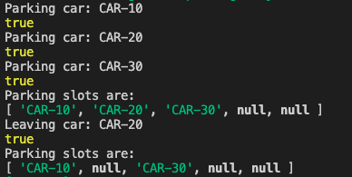

### Parking Lot

- Create a solution to manage a parking lot.

- Implement the ParkingLot class that manages a parking lot with a number of slots or spaces. The class has the following constructor and methods:
1. The constructor ParkingLot(slots) where parameter slots is the size of the parking lot. Slots are numbered consecutively from 1 to slots, [1, 2, 3, .., slots).
2. The method park(carid) - Parks the car with the given carld at the unoccupied slot with the lowest number and returns true. If all slots are occupied, the car is not parked and it returns false.
3. The method getSlots) - Returns an array of all the parking slots where the ith element is the id of the car parked there, or null if the slot is unoccupied.
4. The method remove(carld) - Frees the parking slot where the car is parked and returns true. It returns false if a car with the given carld is not found.

- The locked stub code validates the correctness of the ParkingLot class implementation by performing the following operations:
1. Park carld: If the return value of the call is true, it prints 'Parking Started: <carld>'. Otherwise, it prints 'Parking Full: < carld>.
2. Remove carld. If the return value is true, it prints 'Car id < carld» removed from parking: Otherwise, it prints 'Car: «carld> not found'.
3. GetSlots: For an occupied slot, it prints 'Parked at slot «slotNumber»: ‹carid». For an unoccupied slot, it prints 'Slot «slotNumber» is empty.

Constraints:
- The maximum number of method calls is 15.
- At any time, no two parked cars have the same carid.

Input Format For Custom Testing
- The first line contains an integer, n, the number of slots in the ParkingLot object.
- The second line contains an integer, m, the number of operationsto be performed.

Each line i of the m subsequent lines (where 0≤1 < m) contains one of the three operations listed above with parameters if required.

